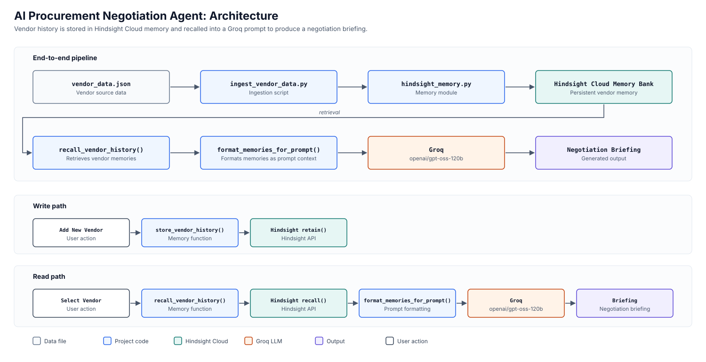
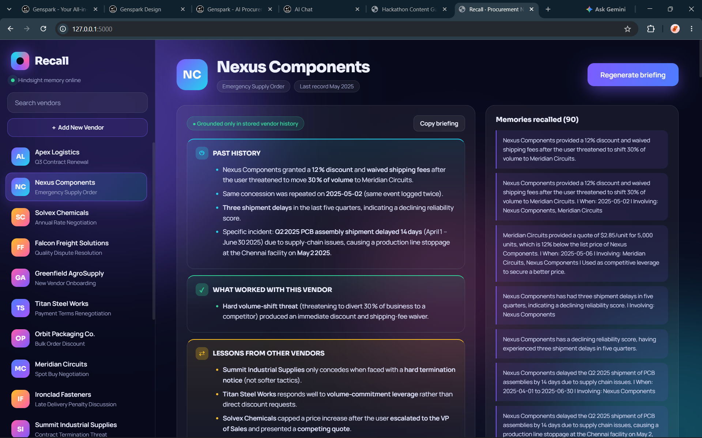
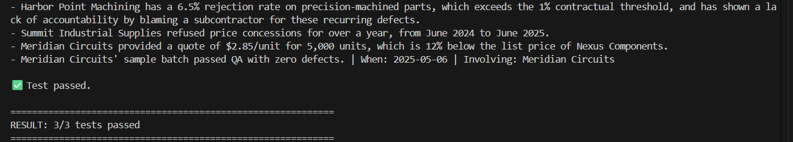

# How I Added Persistent Vendor Memory with Hindsight

A procurement agent that only stores vendor facts is easy to build. The harder problem is making it remember why a negotiation tactic worked, and for which vendor. "Solvex agreed to a 4% cap" is a fact. "Solvex only moved after escalation and a documented competing quote, and ignored a request for best and final" is the part a negotiator can act on. That context is buried in free-text notes, and it is lost between negotiations.

My part of this project was the memory layer: storing vendor negotiation history in [Hindsight](https://github.com/vectorize-io/hindsight) and recalling it so an LLM can turn it into a briefing. This post covers how that layer works, a client lifecycle bug I hit in Flask, and what I did and did not verify.

## Why the history has to be vendor-specific

The dataset illustrates why the history has to be vendor-specific. Each vendor responds to something different:

- Solvex Chemicals only moved on a price increase after escalation and a documented competing quote. Asking for "best and final" did nothing.
- Summit Industrial Supplies only moved after a formal termination notice.
- Vertex Industrial Gases backed down when shown written benchmark data.
- Titan Steel Works agreed to longer payment terms in exchange for a volume commitment.
- Falcon Freight Solutions is the opposite case: repeated complaints and two termination threats that were never followed through, with no recorded change in behavior.

A generic negotiation checklist would not capture these vendor-specific differences. The useful knowledge is per-vendor and written as free text, so I worked from 15 records, each with `vendor_name`, `content`, `context` and `timestamp`.

## What Hindsight provides

Hindsight gave the project a hosted memory bank with two operations, `retain` and `recall`, behind a small Python client. I used it through one module, `hindsight_memory.py`. It reads `HINDSIGHT_API_KEY` and `HINDSIGHT_BANK_ID` from `.env` and raises a `ValueError` at import time if either is missing. For background on the concept, see [Hindsight's documentation](https://hindsight.vectorize.io/) and [what agent memory is](https://vectorize.io/what-is-agent-memory).

## The architecture of the memory flow



There are two paths through one module:

- **Write path:** `vendor_data.json` (or the add-vendor endpoint) → `store_vendor_history()` → `retain`
- **Read path:** vendor selected → `recall_vendor_history()` → `format_memories_for_prompt()` → Groq → briefing

The important design decision is the boundary. Hindsight is isolated behind a small Python wrapper, and `hindsight_memory.py` is the only file that imports the Hindsight client. The ingestion script, the Flask server and the CLI agent all call the wrapper's functions. Recall returns a plain `list[str]`, and `format_memories_for_prompt()` works on those strings, so the rest of the application never handles a Hindsight-specific object. Everything downstream of the wrapper deals only with text.

## Storing history with `retain()`

Each record becomes one retained memory:

```python
def store_vendor_history(vendor_name, content,
                         context="vendor negotiation history", timestamp=None):
    if timestamp:
        timestamp = datetime.fromisoformat(timestamp.replace("Z", "+00:00"))

    return get_client().retain(
        bank_id=BANK_ID,
        content=f"Vendor: {vendor_name}\n{content}",
        context=context,
        timestamp=timestamp
    )
```

There are three choices here. The vendor name is prepended to the content as `Vendor: <name>`, so entity identity travels inside the memory text. The record's `context` (for example "Annual Rate Negotiation") and its timestamp are passed as separate fields. The seed timestamps end in `Z`, so I normalize them to `+00:00` before parsing.

`ensure_bank()` creates the bank and treats an "already exists" or 409 response as success, so setup can be re-run safely. The ingestion script verifies the connection, then loops over the records with a try/except per record, so one failure doesn't abort the load. All 15 original vendor records were ingested successfully.

## Recalling history with `recall()`

Recall mirrors the write format:

```python
def recall_vendor_history(query, vendor_name=None):
    if vendor_name:
        query = f"Vendor: {vendor_name}. {query}"

    result = get_client().recall(bank_id=BANK_ID, query=query)
    return [memory.text for memory in result.results]
```

The query gets the same `Vendor:` prefix used at retain time, and the last line is where Hindsight results are converted into plain strings. I don't pass a vendor filter. Scoping to a vendor comes only from the query text, so recall can return memories about other vendors. I treat that as a fact the rest of the system has to tolerate, and the prompt is written accordingly. The server uses the same core question: what happened in previous negotiations and what tactics worked?

## Getting memory into the Groq model

`format_memories_for_prompt()` turns the recalled strings into `- ` bullets, or into "No relevant vendor history found." when nothing comes back. The result is injected into a prompt for `openai/gpt-oss-120b` on Groq.

The prompt constrains the model to the recalled history:

- Use only the provided history.
- Do not invent dates, prices, discounts, negotiations or outcomes.
- If the information isn't there, say it is not available.
- Use four fixed sections: past history, what worked with this vendor, lessons from other vendors, and next considerations.

If no successful tactic is recorded, the model must say exactly that. Lessons from other vendors must be labeled as such, and suggestions must not be presented as guaranteed. The server's `/api/brief` endpoint returns both the briefing and the raw recalled memories, so the output can be checked against what was actually retrieved.



## The bug that only showed up in Flask

The memory layer worked as a script. The problem appeared when I put it behind the Flask application. I had kept the Hindsight client globally in the app, and calls failed with:

```
Timeout context manager should be used inside a task
```

I did not trace the exact internal root cause. The error is consistent with a globally held client being used across the Flask and thread boundary: the route is `async` and dispatches recall through `asyncio.to_thread`, so the Hindsight call runs on a worker thread.

The fix was to stop sharing a client. `get_client()` now builds a new one every time, and every operation (`create_bank`, `retain`, `recall`) goes through it:

```python
def get_client():
    return Hindsight(base_url=CLOUD_URL, api_key=API_KEY)
```

After that change the Flask application ran and the Hindsight-backed briefing flow worked. The trade-off is that nothing is reused between operations. I did not measure whether that costs anything here. `close_client()` remains as an empty function, which is consistent with there no longer being a long-lived client to close.

## Testing the memory layer

I tested retrieval separately from generation, so a recall problem could be told apart from an LLM problem. `test_hindsight_recall.py` runs a natural-language query for a vendor, joins the recalled memories into one lowercase string, and checks that every expected keyword appears:

- **Nexus Components:** `14 days`, `12%`, `Meridian`
- **Solvex Chemicals:** `BlueRock`, `4%`, `competing quote`
- **Apex Logistics:** `98.6%`, `zero quality`, `on-time`

Result: **3/3 tests passed.**



Two of the three cases expect a related vendor's name (Meridian, BlueRock) to come back, which is a slightly stronger check than matching the vendor's own record. I also exercised the Groq agent through the CLI version with vendor-specific input, including Apex Logistics and Falcon Freight Solutions.

## What memory changes: Solvex and Falcon

**Solvex.** The stored record says Solvex asked for a 9% increase, ignored a "best and final" request, and agreed to cap it at 4% only after escalation to their VP of Sales and a competing quote from BlueRock Industrial ($4.20/L against their $4.65/L). The recall test confirmed that memory surfaces `BlueRock`, `4%` and `competing quote`. That gives the briefing the specific tactic that worked, and what didn't.

The "before" here is the system's designed no-memory behavior, not a measured baseline. With no history, the model receives "No relevant vendor history found." and is instructed to say the information is not available. I did not run a memoryless comparison, and I did not capture a Solvex briefing, so I'm not showing one.

**Falcon Freight.** The record describes four damage complaints in 2025, a roughly 7% damage rate against a 2% benchmark, $150 token credits, and two termination threats that weren't carried out. In my CLI test, the generated briefing correctly said that no successful negotiation tactic was recorded in the available history. I read this as the grounding rules working: the history contains failed tactics, and the briefing did not turn them into advice about what worked. That reading rests on this one confirmed behavior, not on a broader evaluation.

## Limitations and lessons

**Limitations.**
- The recall tests are keyword-presence checks over three vendors. They show that expected facts come back, not how well results are ranked or how much unrelated material accompanies them.
- Vendor scoping relies on query text, so recall can include other vendors' memories.
- Re-running the ingestion script would retain every record again, since it has no deduplication.
- Adding a vendor at runtime retains to Hindsight, then updates the in-memory list, then rewrites `vendor_data.json`, with no rollback if a later step fails.
- The per-operation client design has not been measured for cost.

**Lessons.**
1. Client lifecycle matters when a memory client meets async code. Something that works in a script can fail in a web app, and creating the client per operation fixed it here.
2. Keep the memory interface narrow. Returning `list[str]` kept Hindsight in one file.
3. Without a hard filter, put identity in the memory text, repeat it in the query, and write the prompt to tolerate other vendors' data.
4. Test retrieval before generation, and be candid about how coarse the check is.
5. Make the model state when memory is empty or has no successful tactic. The Falcon result was the clearest evidence that this works.

The layer is small: a handful of functions around `retain` and `recall`. Most of the effort went into the boundaries, namely what goes into the memory text, how the query is shaped, how results reach the prompt, and how the client is created.
